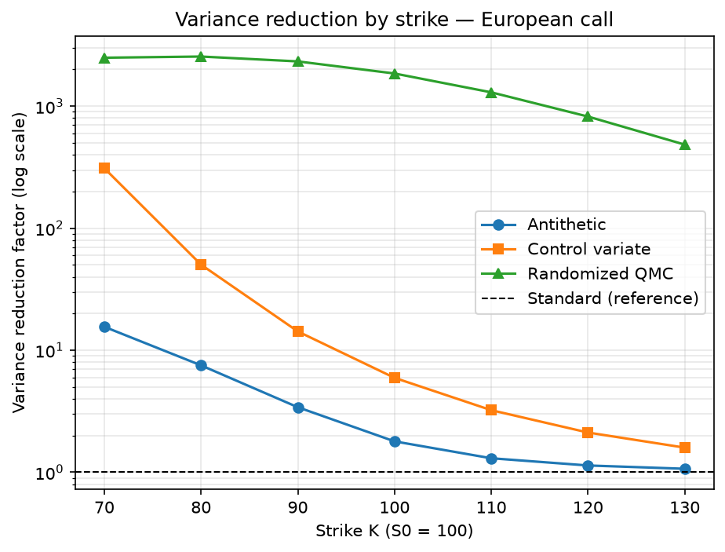
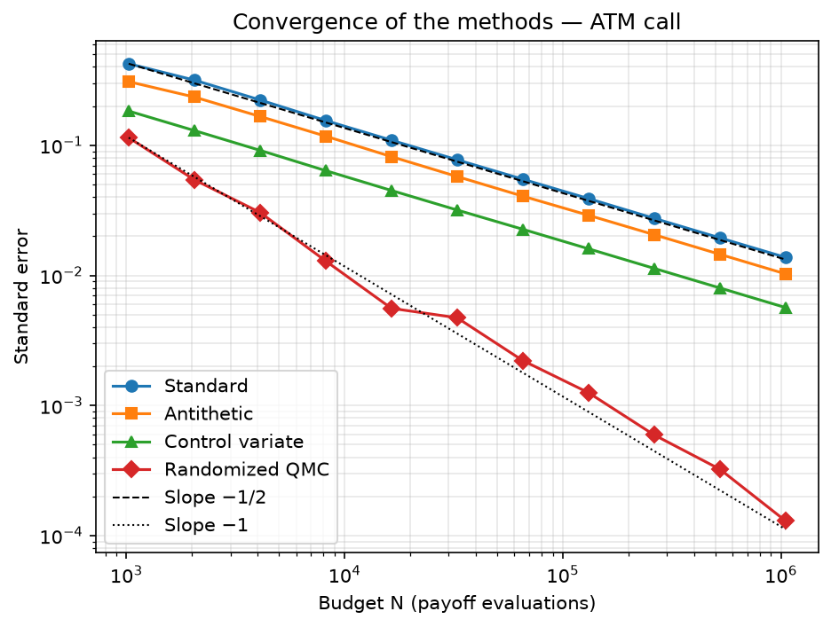
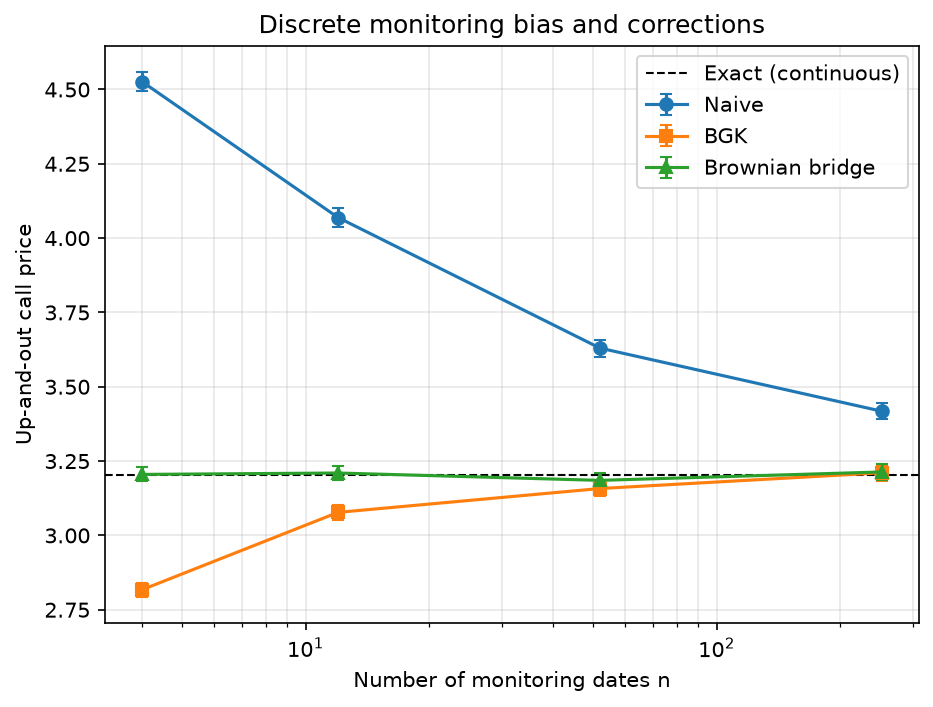

# monte-carlo-pricing

A Monte Carlo pricing engine for equity derivatives under Black-Scholes, written in Python with NumPy and SciPy.

Every method is validated on products with a closed-form price: European calls and puts, geometric Asian calls and continuously monitored up-and-out calls. The arithmetic Asian call, which has no closed form, is priced with the geometric one as a control variate. The project covers:

- **Monte Carlo basics**: generic engine `mc_price(payoff, ...)`, standard errors, Student confidence intervals, $1/\sqrt{N}$ convergence, put-call parity.
- **Variance reduction**: antithetic variates (with a proof that $\rho \le 0$ for monotone payoffs), optimal control variate, randomized quasi-Monte Carlo (Sobol + random shift), compared at equal budget.
- **Path simulation**: Euler and Milstein schemes (strong and weak error), exact paths, Brownian bridge construction.
- **Exotic options**: arithmetic Asian calls (geometric control variate, QMC with Brownian bridge) and up-and-out barrier calls (Broadie-Glasserman-Kou and Brownian-bridge corrections of the discrete monitoring bias).

The notebooks (in French) contain the derivations and the numerical experiments; the `mcpricing` package contains the reusable code.

## Project structure

```
monte-carlo-pricing/
├── mcpricing/                  # the package
│   ├── payoffs.py              # call and put payoffs
│   ├── closed_form.py          # Black-Scholes, geometric Asian, up-and-out call
│   ├── simulation.py           # S_T, exact paths, Brownian bridge, Euler and Milstein schemes
│   ├── engine.py               # summarize (Student CI) and the generic mc_price engine
│   ├── variance_reduction.py   # antithetic, control variate, randomized QMC
│   └── exotics.py              # Asian payoffs, QMC for Asians, barrier estimators
├── notebooks/
│   ├── etape1_mc_black_scholes.ipynb        # step 1: European options, convergence, parity
│   ├── etape2_reduction_variance.ipynb      # step 2: variance reduction
│   └── etape3_trajectoires_exotiques.ipynb  # step 3: discretization schemes, Asian and barrier options
├── tests/                      # pytest suite
├── scripts/
│   └── make_figures.py         # regenerates the README figures (English labels)
├── figures/                    # README figures
├── pyproject.toml
└── requirements.txt
```

The modules depend on each other in one direction only: `payoffs`, `closed_form` and `simulation` are the building blocks, `engine` builds on `simulation`, and `variance_reduction` and `exotics` build on both.

## Installation

```bash
git clone https://github.com/kyle-amar/monte-carlo-pricing.git
cd monte-carlo-pricing
pip install -r requirements.txt
pip install -e .        # editable install: notebooks and tests import mcpricing
```

## Quick start

```python
from mcpricing import mc_price, call_payoff, bs_call_price, barrier_mc, up_and_out_call

params = dict(S0=100.0, K=100.0, T=1.0, r=0.03, sigma=0.2)

price, se, (lo, hi) = mc_price(call_payoff, **params, n_paths=1_000_000, seed=42)
# price = 9.4161, se = 0.0141, 95% CI = [9.3884, 9.4438]; exact: bs_call_price(**params) = 9.4134

price, se, _ = barrier_mc(**params, B=130.0, n_steps=12, n_paths=200_000, method="bridge", seed=7)
# price = 3.2099, se = 0.0126; exact (continuous monitoring): up_and_out_call(**params, B=130.0) = 3.2027
```

Every estimator returns the same triple `(price, standard error, confidence interval)`.

## Running the tests

```bash
pytest
```

The suite (32 tests, about 3 seconds) checks:

- convergence of `mc_price` to the Black-Scholes price, and the $1/\sqrt N$ decay of the standard error;
- put-call parity, for the closed forms (to $10^{-10}$) and for Monte Carlo;
- the Student quantile used by `summarize` ($t_{15} \approx 2.131$ for 16 samples, $\to 1.96$ for large samples);
- $\rho \le 0$ for antithetic calls and puts, and $\rho = 1$ for a payoff even in $Z$;
- unbiasedness of the antithetic, control variate and randomized QMC estimators;
- the geometric Asian closed form against Monte Carlo;
- the Brownian-bridge barrier estimator against the closed form, with 4 and 52 monitoring dates;
- the upward bias of the naive barrier estimator, and the covariance of the Brownian bridge.

Seeds are fixed, so the tests are deterministic. A Monte Carlo estimate passes if it lies within 4 standard errors of the exact value: with any other seed, a correct estimator would fail with probability about $6 \times 10^{-5}$.

## Regenerating the figures

```bash
python scripts/make_figures.py
```

The script rebuilds the figures in `figures/` with the `mcpricing` package, using the same parameters and seeds as the notebooks (about 10 seconds).

## Main results

Parameters throughout: $S_0 = 100$, $K = 100$, $T = 1$, $r = 3\%$, $\sigma = 20\%$.

### European call: convergence

Black-Scholes price: **9.4134**.

| N | MC price | Std. error | 95% CI |
|---:|---:|---:|---|
| $10^4$ | 9.3130 | 0.1416 | [9.0354, 9.5906] |
| $10^5$ | 9.3875 | 0.0449 | [9.2996, 9.4754] |
| $10^6$ | 9.4161 | 0.0141 | [9.3884, 9.4438] |
| $10^7$ | 9.4109 | 0.0045 | [9.4022, 9.4197] |

Dividing the error by 10 costs 100 times more simulations: this is what motivates variance reduction.

### Variance reduction at equal budget

ATM call, $N = 2^{18}$ payoff evaluations per method. The variance reduction factor is $\mathrm{Var}_{\text{standard}} / \mathrm{Var}_{\text{method}}$, i.e. how many times fewer simulations are needed for the same accuracy.

| Method | Price | Std. error | Variance reduction |
|---|---:|---:|---:|
| Standard | 9.41805 | 0.02769 | 1.0 |
| Antithetic | 9.43491 | 0.02068 | 1.8 |
| Control variate ($e^{-rT} S_T$) | 9.41806 | 0.01136 | 5.9 |
| Randomized QMC (16 × $2^{14}$ Sobol points) | 9.41213 | 0.00064 | 1855 |

The gains depend strongly on moneyness (call, variance reduction factor):

| Strike | Antithetic | Control variate | Randomized QMC |
|---:|---:|---:|---:|
| 70 | 15.6 | 310.4 | 2497 |
| 100 | 1.8 | 5.9 | 1855 |
| 130 | 1.1 | 1.6 | 485 |

Antithetic correlation $\rho = \mathrm{Corr}(g(Z), g(-Z))$: $-0.445$ for the ATM call and $-0.477$ for the ATM put (gain guaranteed), $+0.901$ for a butterfly spread (not monotone, variance almost doubled).





### Discretization schemes

Strong error $\mathbb E|\hat S_T - S_T|$ against the exact solution with the same Brownian increments: order $1/2$ for Euler, order $1$ for Milstein (at $n = 256$ steps: 0.145 vs 0.0022). The weak error, which drives the pricing bias, is of order $1$ for both schemes.

### Arithmetic Asian call

The geometric Asian call (closed form) is used as a control variate for the arithmetic one (100,000 paths):

| Dates $n$ | Correlation $\rho$ | Price (control variate) | Std. error | Variance reduction |
|---:|---:|---:|---:|---:|
| 12 | 0.99963 | 5.6318 | 0.00071 | 1338 |
| 52 | 0.99964 | 5.3643 | 0.00067 | 1371 |

With randomized QMC in dimension $n$ (65,536 paths), the Brownian bridge construction keeps most of the gain that the incremental construction loses as the dimension grows:

| Dimension $n$ | QMC, incremental | QMC, Brownian bridge |
|---:|---:|---:|
| 4 | 91 | 200 |
| 16 | 42 | 182 |
| 64 | 9 | 119 |

### Up-and-out barrier call

$B = 130$, continuous-monitoring price (closed form): **3.2027**. 200,000 paths, standard errors in parentheses.

| Monitoring dates | Naive | BGK | Brownian bridge |
|---:|---:|---:|---:|
| 4 | 4.5267 (0.0167) | 2.8170 (0.0121) | **3.2052** (0.0119) |
| 12 | 4.0692 (0.0157) | 3.0775 (0.0130) | **3.2099** (0.0126) |
| 52 | 3.6301 (0.0147) | 3.1577 (0.0134) | **3.1851** (0.0130) |
| 252 | 3.4178 (0.0141) | 3.2106 (0.0136) | **3.2134** (0.0134) |

The naive estimator misses barrier crossings between dates and overestimates the price. The BGK shifted barrier is accurate only asymptotically. The Brownian-bridge estimator is unbiased for any number of dates.



## Roadmap

- **Greeks**: delta, gamma and vega by finite differences with common random numbers, pathwise derivatives and the likelihood ratio method.
- **Heston model**: stochastic volatility, discretization of the variance process (full truncation, QE scheme), calibration to the implied volatility smile.
- **American options**: Longstaff-Schwartz regression, lower and upper bounds.

## License

MIT, see [LICENSE](LICENSE).
